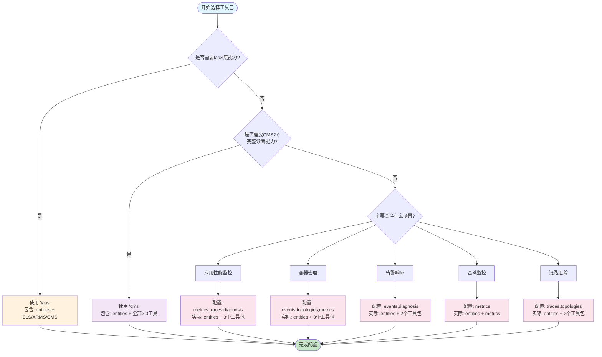

# 阿里云可观测 MCP 工具最佳组合推荐

## 工具组合推荐表

### 一、按场景推荐的工具组合

> 📌 **重要说明**：`entities` 工具包是基础工具包，在所有场景中都会自动包含（除非明确排除）。以下配置中 entities 已默认包含。

| 场景类型 | 推荐配置 | 包含工具包 | 工具数量 | 典型用例 | 优势 |
|---------|---------|-----------|---------|---------|------|
| **🚀 AIOps全场景** | `cms` 或 `all` | entities(5) + metrics(3) + traces(2) + events(2) + topologies(1) + diagnosis(2) + drilldown(1) + workspace(1) (+ iaas for all) | 17-33个 | - 智能运维平台<br>- 企业级监控中心<br>- 多云统一管理 | 功能最全，覆盖所有监控诊断场景 |
| **📊 APM性能监控** | `metrics,traces,diagnosis` | entities(5) + metrics(3) + traces(2) + diagnosis(2) | 12个 | - 微服务性能分析<br>- API延迟优化<br>- 服务依赖分析 | 专注应用性能，精简高效 |
| **☸️ 容器运维** | `events,topologies,metrics` | entities(5) + events(2) + topologies(1) + metrics(3) | 11个 | - K8s集群管理<br>- Pod故障排查<br>- 节点资源监控 | 完整容器生态监控 |
| **📝 日志分析** | `iaas` | entities(5) + sls(6) + arms(8) + cms(2) | 21个 | - 日志检索分析<br>- 错误日志追踪<br>- 审计日志查询 | 传统工具+实体管理 |
| **⚡ 轻量监控** | `metrics` | entities(5) + metrics(3) | 8个 | - 基础指标监控<br>- 资源使用追踪<br>- 简单告警配置 | 最精简配置，快速部署 |
| **🚨 告警响应** | `events,diagnosis` | entities(5) + events(2) + diagnosis(2) | 9个 | - 告警根因分析<br>- 事件关联分析<br>- 快速故障定位 | 快速响应，精准定位 |
| **🔍 链路追踪** | `traces,topologies` | entities(5) + traces(2) + topologies(1) | 8个 | - 分布式追踪<br>- 服务调用分析<br>- 依赖关系梳理 | 专注链路，拓扑清晰 |
| **📈 指标诊断** | `metrics,diagnosis,drilldown` | entities(5) + metrics(3) + diagnosis(2) + drilldown(1) | 11个 | - 指标异常检测<br>- 趋势分析预测<br>- 多维度下钻 | 深度分析，智能诊断 |

### 二、按团队规模推荐

| 团队规模 | 推荐配置 | 理由 | 核心功能 |
|---------|---------|------|---------|
| **初创团队(1-10人)** | `metrics` | 简单易用，学习成本低 | 实体管理+基础监控 |
| **小型团队(10-50人)** | `metrics,events,diagnosis` | 平衡功能与复杂度 | 实体+监控+告警+诊断 |
| **中型团队(50-200人)** | `cms` | 完整的可观测2.0能力 | 全链路监控、智能诊断 |
| **大型团队(200+人)** | `all` | 需要完整的新旧系统兼容 | 全功能覆盖、多系统集成 |

### 三、按技术栈推荐

| 技术栈 | 推荐配置 | 关键工具 | 特殊说明 |
|--------|---------|---------|---------|
| **微服务架构** | `traces,topologies,metrics` | entities_list + traces_list, traces_get_detail, topologies_list_neighbors | 实体管理+服务间调用和依赖 |
| **Kubernetes** | `events,topologies,metrics` | entities_list(k8s.pod) + events_list | 实体+容器事件和Pod管理 |
| **Serverless** | `metrics,traces` | entities_list + metrics_get_golden_signals, traces_list | 实体+冷启动和执行性能 |
| **传统应用** | `iaas` | entities_list + sls_execute_sql_query, arms_search_apps | 实体+成熟的V1工具集 |
| **混合架构** | `all` | 全部工具 | 新旧系统并存，需要全覆盖 |

### 四、按问题类型推荐

| 问题类型 | 推荐工具组合 | 核心工具调用顺序 | 预期效果 |
|---------|-------------|----------------|----------|
| **延迟飙高** | `metrics,traces,topologies,diagnosis` | 1. entities_list（自动包含）<br>2. metrics_get_golden_signals<br>3. diagnosis_detect_metric_anomaly<br>4. traces_list<br>5. topologies_list_neighbors | 快速定位慢服务和瓶颈点 |
| **错误率激增** | `traces,events,diagnosis` | 1. entities_list（自动包含）<br>2. events_list<br>3. traces_list(error=true)<br>4. diagnosis_detect_trace_anomaly | 找出错误根源和影响范围 |
| **资源瓶颈** | `metrics,drilldown` | 1. entities_list（自动包含）<br>2. metrics_get_series(cpu/memory)<br>3. drilldown_metric | 识别资源热点和优化点 |
| **服务雪崩** | `topologies,events,traces,diagnosis` | 1. entities_list（自动包含）<br>2. topologies_list_neighbors<br>3. events_summarize<br>4. traces_list<br>5. diagnosis_detect_trace_anomaly | 快速隔离故障传播路径 |
| **间歇性故障** | `events,metrics,diagnosis` | 1. entities_list（自动包含）<br>2. events_list(时间范围)<br>3. metrics_get_series<br>4. diagnosis_detect_metric_anomaly | 捕获偶发异常模式 |

### 五、工具包详细说明

#### CMS工具集（可观测2.0）- 17个工具

| 工具包 | 工具数量 | 主要功能 | 适用域 | 特殊说明 |
|--------|---------|---------|--------|---------|  
| **entities** | 5 | 实体管理与搜索 | 全域 | 📦 基础工具包，所有场景默认包含 |
| **metrics** | 3 | 指标查询与分析 | APM、容器、云产品 |
| **traces** | 2 | 链路追踪与详情 | APM |
| **events** | 2 | 事件查询与汇总 | 全域 |
| **topologies** | 1 | 拓扑关系查询 | APM、容器 |
| **diagnosis** | 2 | 异常检测与诊断 | 全域 |
| **drilldown** | 1 | 多维下钻分析 | 指标域 |
| **workspace** | 1 | 工作空间管理 | 配置管理 |

#### IaaS工具集（V1兼容）- 16个工具

| 工具包 | 工具数量 | 主要功能 | 优势 |
|--------|---------|---------|------|
| **SLS** | 6 | 日志查询、SQL生成、诊断 | 成熟稳定，功能丰富 |
| **ARMS** | 8 | 应用监控、火焰图、链路分析 | 深度APM能力 |
| **CMS** | 2 | PromQL查询与生成 | 标准Prometheus兼容 |

### 六、配置示例

```bash
# 1. 快速开始（轻量级）- entities 默认包含
export MCP_ENABLED_TOOLKITS=metrics
python -m mcp_server_aliyun_observability --transport sse
# 实际加载: entities + metrics

# 2. APM场景 - entities 默认包含
export MCP_ENABLED_TOOLKITS=metrics,traces,diagnosis
python -m mcp_server_aliyun_observability --transport sse
# 实际加载: entities + metrics + traces + diagnosis

# 3. 完整功能（推荐生产环境）
export MCP_ENABLED_TOOLKITS=cms
python -m mcp_server_aliyun_observability --transport sse
# 实际加载: entities + metrics + traces + events + topologies + diagnosis + drilldown + workspace

# 4. 仅传统工具 - entities 默认包含
export MCP_ENABLED_TOOLKITS=iaas
python -m mcp_server_aliyun_observability --transport sse
# 实际加载: entities + iaas(sls/arms/cms)

# 5. 明确排除 entities（不推荐）
export MCP_ENABLED_TOOLKITS=-entities,metrics
python -m mcp_server_aliyun_observability --transport sse
# 实际加载: 仅 metrics（不包含 entities）
```

### 七、选择决策树



**决策说明**：
- 📦 **entities 工具包**在所有配置中都会自动包含（基础能力）
- 🔧 **IaaS层能力**：需要使用传统SLS/ARMS/CMS工具时选择
- 🚀 **CMS2.0能力**：需要完整的可观测2.0诊断分析时选择
- 🎯 **场景化配置**：根据具体场景选择最精简的工具组合

### 八、性能与资源对比

| 配置 | 实际加载 | 启动时间 | 内存占用 | CPU使用率 | 网络开销 |
|------|---------|---------|---------|-----------|---------|
| `metrics` | entities + metrics | ~1s | ~50MB | 低 | 最小 |
| `cms` | entities + 7个工具包 | ~2s | ~120MB | 中 | 中等 |
| `all` | entities + 所有工具包 | ~3s | ~200MB | 中高 | 较大 |
| `iaas` | entities + iaas | ~2s | ~100MB | 中 | 中等 |

### 九、迁移建议

| 当前使用 | 建议迁移到 | 迁移步骤 |
|---------|-----------|---------|
| V1传统工具 | CMS工具集 | 1. 先使用`all`保持兼容<br>2. 逐步迁移到CMS工具<br>3. 最终切换到`cms` |
| 单一SLS | `entities,metrics,traces` | 1. 保留iaas中的SLS工具<br>2. 增加entities和traces<br>3. 逐步替换为新工具 |
| 纯ARMS | `cms` | 直接切换，功能覆盖完整 |

### 十、最佳实践建议

1. **开发环境**：使用 `entities,metrics` 快速验证
2. **测试环境**：使用 `cms` 进行完整测试
3. **生产环境**：根据实际需求选择，建议从 `cms` 开始
4. **问题排查**：临时切换到 `all` 获取最全面的工具支持
5. **性能优化**：只加载必需的工具包，减少资源消耗

---

**注意事项**：
- 工具包之间存在依赖关系，某些组合可能更高效
- 可以随时通过环境变量调整加载的工具包
- 建议定期评估和优化工具包配置