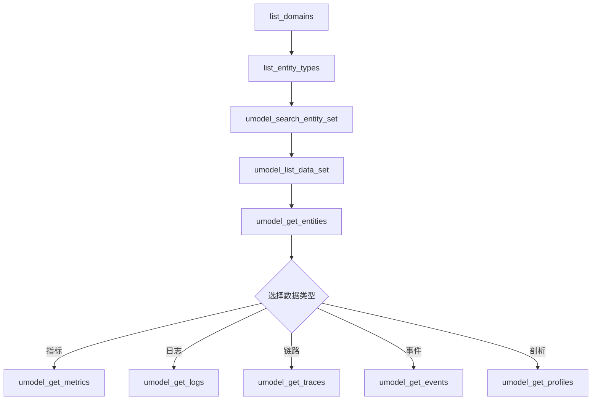

# 阿里云可观测性 MCP Server Release Note

*发布时间：2025年09月09日*

> **⚠️ Beta版本声明**  
> 当前版本为Beta测试版本，功能和API可能会有调整。实际能力和稳定性以最终正式发布版本为准。

## 🎯 项目概述

阿里云可观测性MCP Server是一个基于**Model Context Protocol (MCP)** 标准的智能可观测性服务，为AI助手提供与阿里云可观测性服务（SLS、ARMS、CMS）的深度集成能力。


---

## 🏗️ 架构设计

### 分层架构理念

```
┌─────────────────────────────────────────────────────────────┐
│                    Agent 层 (AI & Insight)                  │
│  🤖 1个智能工具 - 自然语言接口，一句话解决复杂问题             │
│     agent_insight                                         │
└─────────────────────────────────────────────────────────────┘
┌─────────────────────────────────────────────────────────────┐
│                   PaaS 层 (Platform API)                   │
│  🔧 14个结构化API - 标准化接口，需要多工具组合使用            │
│     实体管理(3) + 数据集管理(3) + 数据查询(8)                │
└─────────────────────────────────────────────────────────────┘
┌─────────────────────────────────────────────────────────────┐
│              IaaS 层 (Raw Data Storage Query)              │
│  ⚙️ 6个原始查询工具 - 面向LogStore/MetricStore存储           │
│     独立于云监控2.0，直接SQL/PromQL访问                    │
└─────────────────────────────────────────────────────────────┘
┌─────────────────────────────────────────────────────────────┐
│                   共享层 (Shared Utils)                    │
│  🔗 2个通用工具 - 跨层共享的基础服务                        │
│     工作空间管理、域发现等                                   │
└─────────────────────────────────────────────────────────────┘
```

### 三层差异简述

**🤖 Agent层 - 最简单**
> 像和专家对话一样，用自然语言问问题就能得到数据，不需要知道UMODEL API如何使用，也不需要懂任何技术细节。

**🔧 PaaS层 - 中等难度**  
> 提供现成的标准工具，但需要多个工具组合才能完成复杂分析，需要理解工具间的依赖关系和使用顺序。

**⚙️ IaaS层 - 最灵活**
> 直接写SQL查询语句，想查什么都可以，但需要懂查询语法和数据结构。

---

**简单对比**：
- **Agent层**：问"这个服务有问题吗？" → 直接得到答案（一步搞定）
- **PaaS层**：先获取实体列表 → 再获取指标数据 → 再获取日志数据 → 组合分析（多步组合）
- **IaaS层**：写SQL语句 → 直接查询数据库 → 自己处理结果（完全自定义）

---

## 🛠️ 工具清单

### Agent层 - AI驱动智能洞察

**总计**: 1个工具

| 工具名称 | 功能描述 | 核心特性 |
|---------|----------|----------|
| `agent_insight` | 🤖 统一智能洞察分析 | • 自然语言问答<br>• 自动选择数据源<br>• 跨模态综合分析<br>• 智能推理和建议 |

**使用场景示例**：
- "payment-service最近有什么错误日志？"
- "获取用户登录服务的响应时间数据"
- "查询这个服务的CPU和内存使用情况"

**⚠️ 使用限制**：
- **功能范围**：目前以取数为主，暂不提供复杂的分析类问题处理
- **依赖要求**：需要升级到可观测2.0平台才能使用

### IaaS层 - 原始数据存储查询

**总计**: 6个工具

IaaS层提供面向LogStore、MetricStore等原始数据存储的直接查询服务，支持SQL和PromQL语法，**完全独立于云监控2.0**，可直接访问SLS底层存储，为专家用户提供最大的查询灵活性。

| 工具名称 | 功能描述 | 主要参数 | 数据源类型 |
|---------|----------|-----------|-----------|
| `sls_text_to_sql` | 🔄 自然语言转SQL | text, project, logStore | LogStore原始日志 |
| `sls_execute_sql` | ⚡ 执行SLS日志查询 | query, from_time, to_time | LogStore原始日志 |
| `cms_execute_promql` | 📊 执行PromQL指标查询 | query, metricStore | MetricStore原始指标 |
| `sls_execute_spl` | 🔧 执行原生SPL查询 | query, workspace | 跨存储类型查询 |
| `sls_list_projects` | 📁 列出SLS项目 | projectName, regionId | 项目级别管理 |
| `sls_list_logstores` | 📋 列出日志库 | project, logStore | 存储级别发现 |

**✅ 使用优势**：
- **无依赖**：完全独立于云监控2.0，直接访问SLS原始存储
- **最大灵活性**：支持任意SQL/PromQL查询，100%自定义能力

### PaaS层 - 基于UMODEL高质量API封装

**总计**: 14个工具 (3个子包)

PaaS层直接基于阿里云统一可观测模型(UMODEL)的高质量API进行封装，提供标准化的可观测性数据访问接口。UMODEL作为阿里云可观测性的核心数据模型，经过生产环境验证，具备高性能、高可靠性的特点。

**⚠️ 使用限制**：
- **平台要求**：仅基于可观测2.0的能力提供，需要升级到可观测2.0平台
- **功能范围**：所有PaaS API功能都依赖于可观测2.0的底层能力

#### 实体管理工具包

| 工具名称 | 功能描述 | 核心参数 | SPL示例 |
|---------|----------|-----------|---------|
| `umodel_get_entities` | 📦 获取实体信息 | domain, entity_set_name, entity_ids | `.entity_set with(domain='apm', name='apm.service') \| entity-call get_entities() \| limit 20` |
| `umodel_get_neighbor_entities` | 🔗 获取邻居实体 | entity_id, domain, entity_set_name | `.entity_set with(domain='apm', name='apm.service', ids=['service-123']) \| entity-call get_neighbor_entities()` |
| `umodel_search_entities` | 🔍 搜索实体 | search_text, domain, entity_set_name | `.entity with(domain='apm', name='apm.service', query='payment') \| limit 20` |

#### 数据集管理工具包

| 工具名称 | 功能描述 | 核心参数 | SPL示例 |
|---------|----------|-----------|---------|
| `umodel_list_data_set` | 📊 列出数据集合 | domain, entity_set_name, data_set_types | `.entity_set with(domain='apm', name='apm.service') \| entity-call list_data_set(['metric_set'])` |
| `umodel_search_entity_set` | 🔎 搜索实体集合 | search_text, domain, entity_set_name | 返回匹配的实体集合名称列表 |
| `umodel_list_related_entity_set` | 🌐 列出相关实体集合 | domain, entity_set_name, relation_type | `.entity_set with(domain='apm', name='apm.service') \| entity-call list_related_entity_set('dependency', 'both', true)` |

#### 数据查询工具包

| 工具名称 | 功能描述 | 核心参数 | SPL示例 |
|---------|----------|-----------|---------|
| `umodel_get_metrics` | 📈 获取时序指标 | metric_domain_name, metric | `.entity_set with(domain='apm', name='apm.service') \| entity-call get_metric('apm', 'system', 'cpu.usage', 'range', '1m')` |
| `umodel_get_golden_metrics` | ⭐ 获取黄金指标 | domain, entity_set_name | `.entity_set with(domain='apm', name='apm.service') \| entity-call get_golden_metrics()` |
| `umodel_get_relation_metrics` | 🔗 获取关系指标 | relation_type, metric | `.entity_set with(domain='apm', name='apm.service') \| entity-call get_relation_metrics('call', 'response_time')` |
| `umodel_get_logs` | 📝 获取日志数据 | log_set_name, log_set_domain | `.entity_set with(domain='apm', name='apm.service') \| entity-call get_logs('application_log')` |
| `umodel_get_events` | 🚨 获取事件数据 | event_set_name, event_set_domain | `.entity_set with(domain='apm', name='apm.service') \| entity-call get_events()` |
| `umodel_get_traces` | 🔗 获取链路数据 | trace_ids, trace_set_name | `.entity_set with(domain='apm', name='apm.service') \| entity-call get_traces('trace-123456')` |
| `umodel_search_traces` | 🔍 搜索链路数据 | trace_filter, entity_ids | `.entity_set with(domain='apm', name='apm.service') \| entity-call search_traces()` |
| `umodel_get_profiles` | ⚡ 获取性能剖析 | profile_type, entity_ids | `.entity_set with(domain='apm', name='apm.service') \| entity-call get_profiles('cpu')` |

### 共享层 - 通用工具

**总计**: 2个工具

| 工具名称 | 功能描述 | 主要用途 |
|---------|----------|----------|
| `list_workspace` | 📋 列出CMS工作空间 | 为其他工具提供workspace参数 |
| `list_domains` | 🏷️ 列出实体域 | 发现可用的domain参数选项 |

---

## 📋 工具依赖关系

### PaaS层工具链流程



### 参数依赖链路

1. **基础发现链路**:
   ```
   list_workspace → 获取workspace
   ↓
   list_domains → 获取domain选项
   ↓
   umodel_search_entity_set → 获取entity_set_name选项
   ```

2. **实体查询链路**:
   ```
   umodel_search_entity_set → 找到目标实体集合
   ↓
   umodel_get_entities → 获取entity_ids
   ↓
   umodel_get_metrics/logs/events/traces → 使用entity_ids查询数据
   ```

3. **数据源发现链路**:
   ```
   umodel_list_data_set(data_set_types="metric_set") → 获取可用指标集合
   ↓
   umodel_get_metrics → 使用指标名称查询时序数据
   ```

---

## 🚀 LLM Agent 集成指南

### 分层使用策略

#### 🤖 Agent层 - 推荐业务用户

**特点**: 一句话搞定复杂分析，无需技术背景

```bash
# 故障排查
agent_insight(
  query="payment-service最近有什么错误？",
  workspace="prod", 
  entity_domain="apm",
  entity_set_name="apm.service"
)

# 性能分析  
agent_insight(
  query="用户登录为什么这么慢？",
  workspace="prod",
  entity_domain="apm", 
  entity_set_name="apm.service"
)
```

#### 🔧 PaaS层 - 推荐开发者用户

**特点**: 标准化API，需要多步骤组合，精确控制

```bash
# 步骤1: 发现实体
umodel_search_entity_set(search_text="payment")

# 步骤2: 获取实体列表
umodel_get_entities(domain="apm", entity_set_name="apm.service")

# 步骤3: 查询指标数据
umodel_get_metrics(
  domain="apm",
  entity_set_name="apm.service", 
  metric_domain_name="apm.metric.jvm",
  metric="cpu_usage"
)
```

#### ⚙️ IaaS层 - 推荐专家用户

**特点**: 最大灵活性，需要SQL/PromQL知识

```bash
# 生成SQL
sls_text_to_sql(
  text="查找最近1小时的错误日志",
  project="my-project",
  logStore="error-logs"
)

# 执行查询
sls_execute_sql(
  project="my-project",
  logStore="error-logs", 
  query="* | where level = 'ERROR'"
)
```

---

## 🤖 LLM Agent + MCP Tool 使用场景

### 场景1: AI助手驱动的故障排查

**Agent角色**: 智能运维助手  
**工具组合**: Agent层 + 多工具协作

**Agent对话流程**:
```
用户: "支付服务宕机了，帮我获取相关数据"

AI助手: 我来帮你获取支付服务的监控数据...
[调用] agent_insight(query="获取payment-service的当前状态数据", ...)

AI助手: 已获取到CPU使用率数据显示异常，让我获取相关日志数据...
[调用] umodel_get_logs(domain="apm", log_set_name="error", ...)

AI助手: 数据获取完成，发现：
📊 CPU使用率: 95% (异常高)
📝 错误日志: 共245条数据库连接错误
⏰ 时间范围: 最近1小时内集中爆发
```

**⚠️ 场景限制**：
- **Agent功能**：目前主要提供数据获取，复杂的根因分析能力有限
- **平台要求**：需要可观测2.0平台支持

### 场景2: 多模态性能分析Agent

**Agent角色**: 性能优化专家  
**工具组合**: PaaS层工具链 + AI推理

```json
// OpenAI Agents SDK集成
{
  "agent": {
    "name": "performance-advisor",
    "tools": [
      "umodel_get_golden_metrics",
      "umodel_get_traces", 
      "umodel_search_traces",
      "umodel_get_profiles"
    ]
  }
}
```

**Agent工作流程**:
```
用户: "电商系统响应慢，用户投诉很多"

AI助手: 我来系统分析性能问题...
[调用] umodel_get_golden_metrics → 发现延迟P99达到5秒
[调用] umodel_search_traces(min_duration_ms=2000) → 找到慢请求
[调用] umodel_get_traces(trace_ids="slow-traces") → 分析调用链
[调用] umodel_get_profiles → 识别CPU热点

AI助手: 性能瓶颈分析结果：
📊 主要问题: 数据库查询优化不足 (占总延迟60%)
🔧 优化建议: 添加索引、查询改写、缓存策略
📈 预期收益: 响应时间可降低70%
```

**⚠️ 场景限制**：
- **平台要求**：所有PaaS工具都需要可观测2.0平台支持
- **数据依赖**：需要目标系统已接入UMODEL数据模型

### 场景3: 企业智能监控Agent

**Agent角色**: 7x24小时监控专家  
**工具组合**: 全层级工具 + 主动监控

```python
# 企业级Agent框架集成 (如LastMile AI mcp-agent)
from mcp_agent import Agent, MCPServer

monitoring_agent = Agent(
    name="enterprise-monitor",
    servers=[
        MCPServer("aliyun-observability", stdio_command=[
            "python", "-m", "mcp_server_aliyun_observability"
        ])
    ]
)
```

**Agent自主监控流程**:
```
定时任务: 每5分钟执行健康检查

AI助手: 开始系统巡检...
[调用] list_workspace → 获取所有环境
[调用] list_domains → 发现监控域
[调用] umodel_get_golden_metrics → 批量检查核心指标

[检测到异常]
AI助手: ⚠️ 检测到订单服务异常！
[调用] agent_insight(query="获取订单服务异常相关数据")
[调用] umodel_get_events → 查找关联事件
[自动生成数据报告并发送告警]

AI助手: 📧 已向运维团队发送监控数据报告
```

**⚠️ 场景限制**：
- **混合工具限制**：Agent和PaaS工具都需要可观测2.0平台
- **分析能力**：自动分析主要基于数据对比和阈值检测

---

*文档版本: v2.0*  
*最后更新: 2025年09月09日*