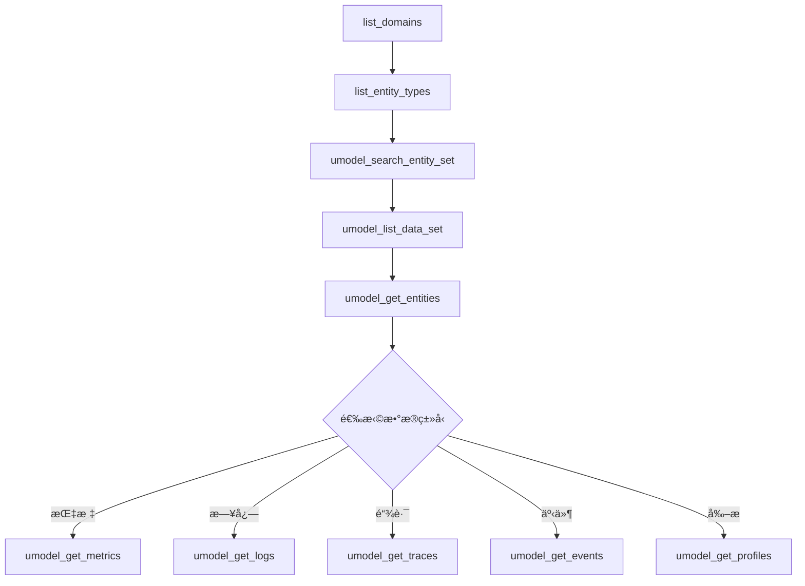

# 阿里云å¯è§‚测性 MCP Server Release Note

*å‘布时间：2025å¹´09月09æ—¥*

> **âš ï¸ Beta版本声æ˜**  
> 当å‰ç‰ˆæœ¬ä¸ºBeta测试版本，功能和APIå¯èƒ½ä¼šæœ‰è°ƒæ•´ã€‚å®é™…能力和稳定性以最终正å¼å‘布版本为准。

## 🯠项目概述

阿里云å¯è§‚测性MCP Server是一个基äº**Model Context Protocol (MCP)** 标准的智能å¯è§‚测性æœåŠ¡ï¼Œä¸ºAI助手æä¾›ä¸é˜¿é‡Œäº‘å¯è§‚测性æœåŠ¡ï¼ˆSLSã€ARMSã€CMS）的深度集æˆèƒ½åŠ›ã€‚


---

## ğŸ—ï¸ æ¶æ„设计

### 分层æ¶æ„ç†å¿µ

```
┌─────────────────────────────────────────────────────────────â”
│                    Agent 层 (AI & Insight)                  │
│  🤖 1个智能工具 - 自然语言æ¥å£ï¼Œä¸€å¥è¯è§£å†³å¤æ‚问题             │
│     agent_insight                                         │
└─────────────────────────────────────────────────────────────┘
┌─────────────────────────────────────────────────────────────â”
│                   PaaS 层 (Platform API)                   │
│  🔧 14个结æ„化API - 标准化æ¥å£ï¼Œéœ€è¦å¤šå·¥å…·ç»„åˆä½¿ç”¨            │
│     å®ä½“管ç†(3) + æ•°æ®é›†ç®¡ç†(3) + æ•°æ®æŸ¥è¯¢(8)                │
└─────────────────────────────────────────────────────────────┘
┌─────────────────────────────────────────────────────────────â”
│              IaaS 层 (Raw Data Storage Query)              │
│  âš™ï¸ 6个åŸå§‹æŸ¥è¯¢å·¥å…· - é¢å‘LogStore/MetricStore存储           │
│     独立äºäº‘监æ§2.0，直æ¥SQL/PromQL访问                    │
└─────────────────────────────────────────────────────────────┘
┌─────────────────────────────────────────────────────────────â”
│                   共享层 (Shared Utils)                    │
│  🔗 2个通用工具 - 跨层共享的基础æœåŠ¡                        │
│     工作空间管ç†ã€åŸŸå‘ç°ç­‰                                   │
└─────────────────────────────────────────────────────────────┘
```

### 三层差异简述

**🤖 Agent层 - 最简å•**
> åƒå’Œä¸“家对è¯ä¸€æ ·ï¼Œç”¨è‡ªç„¶è¯­è¨€é—®é—®é¢˜å°±èƒ½å¾—到数æ®ï¼Œä¸éœ€è¦çŸ¥é“UMODEL API如何使用，也ä¸éœ€è¦æ‡‚任何技术细节。

**🔧 PaaS层 - 中等难度**  
> æä¾›ç°æˆçš„标准工具，但需è¦å¤šä¸ªå·¥å…·ç»„åˆæ‰èƒ½å®Œæˆå¤æ‚分æ，需è¦ç†è§£å·¥å…·é—´çš„ä¾èµ–关系和使用顺åºã€‚

**âš™ï¸ IaaS层 - 最çµæ´»**
> ç›´æ¥å†™SQL查询语å¥ï¼Œæƒ³æŸ¥ä»€ä¹ˆéƒ½å¯ä»¥ï¼Œä½†éœ€è¦æ‡‚查询语法和数æ®ç»“æ„。

---

**简å•å¯¹æ¯”**：
- **Agent层**：问"这个æœåŠ¡æœ‰é—®é¢˜å—？" → ç›´æ¥å¾—到答案（一步æ定）
- **PaaS层**：先è·å–å®ä½“列表 → å†è·å–æŒ‡æ ‡æ•°æ® â†’ å†è·å–æ—¥å¿—æ•°æ® â†’ 组åˆåˆ†æ（多步组åˆï¼‰
- **IaaS层**：写SQLè¯­å¥ â†’ ç›´æ¥æŸ¥è¯¢æ•°æ®åº“ → 自己处ç†ç»“æœï¼ˆå®Œå…¨è‡ªå®šä¹‰ï¼‰

---

## ğŸ› ï¸ å·¥å…·æ¸…å•

### Agent层 - AI驱动智能æ´å¯Ÿ

**总计**: 1个工具

| 工具å称 | 功能æè¿° | 核心特性 |
|---------|----------|----------|
| `agent_insight` | 🤖 统一智能æ´å¯Ÿåˆ†æ | • 自然语言问答<br>• 自动选择数æ®æº<br>• 跨模æ€ç»¼åˆåˆ†æ<br>• 智能æ¨ç†å’Œå»ºè®® |

**使用场景示例**：
- "payment-service最近有什么错误日志？"
- "è·å–用户登录æœåŠ¡çš„å“应时间数æ®"
- "查询这个æœåŠ¡çš„CPU和内存使用情况"

**âš ï¸ ä½¿ç”¨é™åˆ¶**：
- **功能范围**：目å‰ä»¥å–数为主，暂ä¸æä¾›å¤æ‚的分æ类问题处ç†
- **ä¾èµ–è¦æ±‚**：需è¦å‡çº§åˆ°å¯è§‚测2.0å¹³å°æ‰èƒ½ä½¿ç”¨

### IaaS层 - åŸå§‹æ•°æ®å­˜å‚¨æŸ¥è¯¢

**总计**: 6个工具

IaaS层æä¾›é¢å‘LogStoreã€MetricStoreç­‰åŸå§‹æ•°æ®å­˜å‚¨çš„ç›´æ¥æŸ¥è¯¢æœåŠ¡ï¼Œæ”¯æŒSQLå’ŒPromQL语法，**完全独立äºäº‘监æ§2.0**，å¯ç›´æ¥è®¿é—®SLS底层存储，为专家用户æ供最大的查询çµæ´»æ€§ã€‚

| 工具å称 | 功能æè¿° | 主è¦å‚æ•° | æ•°æ®æºç±»å‹ |
|---------|----------|-----------|-----------|
| `sls_text_to_sql` | 🔄 自然语言转SQL | text, project, logStore | LogStoreåŸå§‹æ—¥å¿— |
| `sls_execute_sql` | âš¡ 执行SLS日志查询 | query, from_time, to_time | LogStoreåŸå§‹æ—¥å¿— |
| `cms_execute_promql` | 📊 执行PromQL指标查询 | query, metricStore | MetricStoreåŸå§‹æŒ‡æ ‡ |
| `sls_execute_spl` | 🔧 执行åŸç”ŸSPL查询 | query, workspace | 跨存储类å‹æŸ¥è¯¢ |
| `sls_list_projects` | 📠列出SLS项目 | projectName, regionId | é¡¹ç›®çº§åˆ«ç®¡ç† |
| `sls_list_logstores` | 📋 列出日志库 | project, logStore | 存储级别å‘ç° |

**✅ 使用优势**：
- **æ— ä¾èµ–**：完全独立äºäº‘监æ§2.0，直æ¥è®¿é—®SLSåŸå§‹å­˜å‚¨
- **最大çµæ´»æ€§**：支æŒä»»æ„SQL/PromQL查询，100%自定义能力

### PaaS层 - 基äºUMODEL高质é‡APIå°è£…

**总计**: 14个工具 (3个å­åŒ…)

PaaS层直æ¥åŸºäºé˜¿é‡Œäº‘统一å¯è§‚测模å‹(UMODEL)的高质é‡API进行å°è£…，æ供标准化的å¯è§‚测性数æ®è®¿é—®æ¥å£ã€‚UMODEL作为阿里云å¯è§‚测性的核心数æ®æ¨¡å‹ï¼Œç»è¿‡ç”Ÿäº§ç¯å¢ƒéªŒè¯ï¼Œå…·å¤‡é«˜æ€§èƒ½ã€é«˜å¯é æ€§çš„特点。

**âš ï¸ ä½¿ç”¨é™åˆ¶**：
- **å¹³å°è¦æ±‚**：仅基äºå¯è§‚测2.0的能力æ供，需è¦å‡çº§åˆ°å¯è§‚测2.0å¹³å°
- **功能范围**：所有PaaS API功能都ä¾èµ–äºå¯è§‚测2.0的底层能力

#### å®ä½“管ç†å·¥å…·åŒ…

| 工具å称 | 功能æè¿° | 核心å‚æ•° | SPL示例 |
|---------|----------|-----------|---------|
| `umodel_get_entities` | 📦 è·å–å®ä½“ä¿¡æ¯ | domain, entity_set_name, entity_ids | `.entity_set with(domain='apm', name='apm.service') \| entity-call get_entities() \| limit 20` |
| `umodel_get_neighbor_entities` | 🔗 è·å–邻居å®ä½“ | entity_id, domain, entity_set_name | `.entity_set with(domain='apm', name='apm.service', ids=['service-123']) \| entity-call get_neighbor_entities()` |
| `umodel_search_entities` | 🔠æœç´¢å®ä½“ | search_text, domain, entity_set_name | `.entity with(domain='apm', name='apm.service', query='payment') \| limit 20` |

#### æ•°æ®é›†ç®¡ç†å·¥å…·åŒ…

| 工具å称 | 功能æè¿° | 核心å‚æ•° | SPL示例 |
|---------|----------|-----------|---------|
| `umodel_list_data_set` | 📊 列出数æ®é›†åˆ | domain, entity_set_name, data_set_types | `.entity_set with(domain='apm', name='apm.service') \| entity-call list_data_set(['metric_set'])` |
| `umodel_search_entity_set` | 🔠æœç´¢å®ä½“é›†åˆ | search_text, domain, entity_set_name | è¿”å›åŒ¹é…çš„å®ä½“集åˆå称列表 |
| `umodel_list_related_entity_set` | 🌠列出相关å®ä½“é›†åˆ | domain, entity_set_name, relation_type | `.entity_set with(domain='apm', name='apm.service') \| entity-call list_related_entity_set('dependency', 'both', true)` |

#### æ•°æ®æŸ¥è¯¢å·¥å…·åŒ…

| 工具å称 | 功能æè¿° | 核心å‚æ•° | SPL示例 |
|---------|----------|-----------|---------|
| `umodel_get_metrics` | 📈 è·å–æ—¶åºæŒ‡æ ‡ | metric_domain_name, metric | `.entity_set with(domain='apm', name='apm.service') \| entity-call get_metric('apm', 'system', 'cpu.usage', 'range', '1m')` |
| `umodel_get_golden_metrics` | â­ è·å–黄金指标 | domain, entity_set_name | `.entity_set with(domain='apm', name='apm.service') \| entity-call get_golden_metrics()` |
| `umodel_get_relation_metrics` | 🔗 è·å–关系指标 | relation_type, metric | `.entity_set with(domain='apm', name='apm.service') \| entity-call get_relation_metrics('call', 'response_time')` |
| `umodel_get_logs` | 📠è·å–æ—¥å¿—æ•°æ® | log_set_name, log_set_domain | `.entity_set with(domain='apm', name='apm.service') \| entity-call get_logs('application_log')` |
| `umodel_get_events` | 🚨 è·å–äº‹ä»¶æ•°æ® | event_set_name, event_set_domain | `.entity_set with(domain='apm', name='apm.service') \| entity-call get_events()` |
| `umodel_get_traces` | 🔗 è·å–é“¾è·¯æ•°æ® | trace_ids, trace_set_name | `.entity_set with(domain='apm', name='apm.service') \| entity-call get_traces('trace-123456')` |
| `umodel_search_traces` | 🔠æœç´¢é“¾è·¯æ•°æ® | trace_filter, entity_ids | `.entity_set with(domain='apm', name='apm.service') \| entity-call search_traces()` |
| `umodel_get_profiles` | âš¡ è·å–性能剖æ | profile_type, entity_ids | `.entity_set with(domain='apm', name='apm.service') \| entity-call get_profiles('cpu')` |

### 共享层 - 通用工具

**总计**: 2个工具

| 工具å称 | 功能æè¿° | 主è¦ç”¨é€” |
|---------|----------|----------|
| `list_workspace` | 📋 列出CMS工作空间 | 为其他工具æä¾›workspaceå‚æ•° |
| `list_domains` | ğŸ·ï¸ 列出å®ä½“域 | å‘ç°å¯ç”¨çš„domainå‚数选项 |

---

## 📋 工具ä¾èµ–关系

### PaaS层工具链æµç¨‹



### å‚æ•°ä¾èµ–链路

1. **基础å‘ç°é“¾è·¯**:
   ```
   list_workspace → è·å–workspace
   ↓
   list_domains → è·å–domain选项
   ↓
   umodel_search_entity_set → è·å–entity_set_name选项
   ```

2. **å®ä½“查询链路**:
   ```
   umodel_search_entity_set → 找到目标å®ä½“集åˆ
   ↓
   umodel_get_entities → è·å–entity_ids
   ↓
   umodel_get_metrics/logs/events/traces → 使用entity_ids查询数æ®
   ```

3. **æ•°æ®æºå‘ç°é“¾è·¯**:
   ```
   umodel_list_data_set(data_set_types="metric_set") → è·å–å¯ç”¨æŒ‡æ ‡é›†åˆ
   ↓
   umodel_get_metrics → 使用指标å称查询时åºæ•°æ®
   ```

---

## 🚀 LLM Agent 集æˆæŒ‡å—

### 分层使用策略

#### 🤖 Agent层 - æ¨è业务用户

**特点**: 一å¥è¯æ定å¤æ‚分æ，无需技术背景

```bash
# æ•…éšœæ’查
agent_insight(
  query="payment-service最近有什么错误？",
  workspace="prod", 
  entity_domain="apm",
  entity_set_name="apm.service"
)

# æ€§èƒ½åˆ†æ  
agent_insight(
  query="用户登录为什么这么慢？",
  workspace="prod",
  entity_domain="apm", 
  entity_set_name="apm.service"
)
```

#### 🔧 PaaS层 - æ¨èå¼€å‘者用户

**特点**: 标准化API，需è¦å¤šæ­¥éª¤ç»„åˆï¼Œç²¾ç¡®æ§åˆ¶

```bash
# 步骤1: å‘ç°å®ä½“
umodel_search_entity_set(search_text="payment")

# 步骤2: è·å–å®ä½“列表
umodel_get_entities(domain="apm", entity_set_name="apm.service")

# 步骤3: 查询指标数æ®
umodel_get_metrics(
  domain="apm",
  entity_set_name="apm.service", 
  metric_domain_name="apm.metric.jvm",
  metric="cpu_usage"
)
```

#### âš™ï¸ IaaS层 - æ¨è专家用户

**特点**: 最大çµæ´»æ€§ï¼Œéœ€è¦SQL/PromQL知识

```bash
# 生æˆSQL
sls_text_to_sql(
  text="查找最近1å°æ—¶çš„错误日志",
  project="my-project",
  logStore="error-logs"
)

# 执行查询
sls_execute_sql(
  project="my-project",
  logStore="error-logs", 
  query="* | where level = 'ERROR'"
)
```

---

## 🤖 LLM Agent + MCP Tool 使用场景

### 场景1: AI助手驱动的故障æ’查

**Agent角色**: 智能è¿ç»´åŠ©æ‰‹  
**工具组åˆ**: Agent层 + 多工具å作

**Agent对è¯æµç¨‹**:
```
用户: "支付æœåŠ¡å®•æœºäº†ï¼Œå¸®æˆ‘è·å–相关数æ®"

AI助手: 我æ¥å¸®ä½ è·å–支付æœåŠ¡çš„监æ§æ•°æ®...
[调用] agent_insight(query="è·å–payment-service的当å‰çŠ¶æ€æ•°æ®", ...)

AI助手: å·²è·å–到CPU使用ç‡æ•°æ®æ˜¾ç¤ºå¼‚常，让我è·å–相关日志数æ®...
[调用] umodel_get_logs(domain="apm", log_set_name="error", ...)

AI助手: æ•°æ®è·å–完æˆï¼Œå‘ç°ï¼š
📊 CPU使用ç‡: 95% (异常高)
📠错误日志: å…±245æ¡æ•°æ®åº“è¿æ¥é”™è¯¯
Ⱐ时间范围: 最近1å°æ—¶å†…集中爆å‘
```

**âš ï¸ åœºæ™¯é™åˆ¶**：
- **Agent功能**：目å‰ä¸»è¦æ供数æ®è·å–，å¤æ‚的根因分æ能力有é™
- **å¹³å°è¦æ±‚**：需è¦å¯è§‚测2.0å¹³å°æ”¯æŒ

### 场景2: 多模æ€æ€§èƒ½åˆ†æAgent

**Agent角色**: 性能优化专家  
**工具组åˆ**: PaaS层工具链 + AIæ¨ç†

```json
// OpenAI Agents SDK集æˆ
{
  "agent": {
    "name": "performance-advisor",
    "tools": [
      "umodel_get_golden_metrics",
      "umodel_get_traces", 
      "umodel_search_traces",
      "umodel_get_profiles"
    ]
  }
}
```

**Agent工作æµç¨‹**:
```
用户: "电商系统å“应慢，用户投诉很多"

AI助手: 我æ¥ç³»ç»Ÿåˆ†æ性能问题...
[调用] umodel_get_golden_metrics → å‘ç°å»¶è¿ŸP99达到5秒
[调用] umodel_search_traces(min_duration_ms=2000) → 找到慢请求
[调用] umodel_get_traces(trace_ids="slow-traces") → 分æ调用链
[调用] umodel_get_profiles → 识别CPU热点

AI助手: 性能瓶颈分æ结æœï¼š
📊 主è¦é—®é¢˜: æ•°æ®åº“查询优化ä¸è¶³ (å æ€»å»¶è¿Ÿ60%)
🔧 优化建议: 添加索引ã€æŸ¥è¯¢æ”¹å†™ã€ç¼“存策略
📈 预期收益: å“应时间å¯é™ä½70%
```

**âš ï¸ åœºæ™¯é™åˆ¶**：
- **å¹³å°è¦æ±‚**：所有PaaS工具都需è¦å¯è§‚测2.0å¹³å°æ”¯æŒ
- **æ•°æ®ä¾èµ–**：需è¦ç›®æ ‡ç³»ç»Ÿå·²æ¥å…¥UMODELæ•°æ®æ¨¡å‹

### 场景3: ä¼ä¸šæ™ºèƒ½ç›‘æ§Agent

**Agent角色**: 7x24å°æ—¶ç›‘æ§ä¸“家  
**工具组åˆ**: 全层级工具 + 主动监æ§

```python
# ä¼ä¸šçº§Agent框æ¶é›†æˆ (如LastMile AI mcp-agent)
from mcp_agent import Agent, MCPServer

monitoring_agent = Agent(
    name="enterprise-monitor",
    servers=[
        MCPServer("aliyun-observability", stdio_command=[
            "python", "-m", "mcp_server_aliyun_observability"
        ])
    ]
)
```

**Agent自主监æ§æµç¨‹**:
```
定时任务: æ¯5分钟执行å¥åº·æ£€æŸ¥

AI助手: 开始系统巡检...
[调用] list_workspace → è·å–所有ç¯å¢ƒ
[调用] list_domains → å‘ç°ç›‘æ§åŸŸ
[调用] umodel_get_golden_metrics → 批é‡æ£€æŸ¥æ ¸å¿ƒæŒ‡æ ‡

[检测到异常]
AI助手: âš ï¸ æ£€æµ‹åˆ°è®¢å•æœåŠ¡å¼‚常ï¼
[调用] agent_insight(query="è·å–订å•æœåŠ¡å¼‚常相关数æ®")
[调用] umodel_get_events → 查找关è”事件
[自动生æˆæ•°æ®æŠ¥å‘Šå¹¶å‘é€å‘Šè­¦]

AI助手: 📧 å·²å‘è¿ç»´å›¢é˜Ÿå‘é€ç›‘æ§æ•°æ®æŠ¥å‘Š
```

**âš ï¸ åœºæ™¯é™åˆ¶**：
- **æ··åˆå·¥å…·é™åˆ¶**：Agentå’ŒPaaS工具都需è¦å¯è§‚测2.0å¹³å°
- **分æ能力**：自动分æ主è¦åŸºäºæ•°æ®å¯¹æ¯”和阈值检测

---

*文档版本: v2.0*  
*最åæ›´æ–°: 2025å¹´09月09æ—¥*