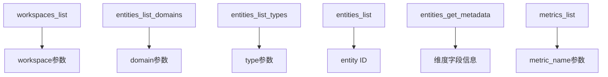

# V2 工具依赖关系图

本文档展示了 V2 MCP 工具之间的依赖关系，帮助用户理解如何组合使用这些工具。

## 工具依赖关系

### 1. 基础查询工具

### 2. 工具使用流程

#### 查询实体相关数据的典型流程：

1. **获取工作空间** → `workspaces_list`
   - 输出：可用的 workspace 列表
   
2. **了解实体结构** 
   - `entities_list_domains` → 获取所有实体域
   - `entities_list_types` → 获取指定域的实体类型
   
3. **查询具体实体** → `entities_list`
   - 输入：workspace, domain, type 等
   - 输出：实体列表和 ID
   
4. **获取实体详情** → `entities_get_metadata`
   - 输入：entity_selector (需要实体ID)
   - 输出：实体的字段、指标、关系等信息

#### 查询指标数据的典型流程：

1. **选择实体** → 使用上述实体查询流程
   
2. **获取可用指标** → `metrics_list`
   - 输入：entity_selector
   - 输出：该实体支持的所有指标
   
3. **查询指标数据** → `metrics_get_series`
   - 输入：entity_selector, metric_name
   - 输出：时序数据

#### 指标下钻分析流程：

1. **获取维度信息** → `entities_get_metadata`
   - 输出：实体支持的维度字段
   
2. **执行下钻分析** → `drilldown_metric`
   - 输入：dimensions（从元数据获取）
   - 输出：多维度分析结果

## 参数依赖关系表

| 参数名 | 获取方式 | 使用该参数的工具 |
|--------|----------|------------------|
| workspace | workspaces_list | 所有工具 |
| domain | entities_list_domains | entities_list, entities_list_types |
| type | entities_list_types | entities_list |
| entity ID | entities_list | entity_selector.ids |
| metric_name | metrics_list | metrics_get_series, diagnosis_detect_metric_anomaly, drilldown_metric |
| dimensions | entities_get_metadata | drilldown_metric |

## 使用建议

1. **从上往下查询**：先获取 workspace，再查询域和类型，最后查询具体实体
2. **缓存常用信息**：workspace、domain、type 等信息相对稳定，可以缓存
3. **批量查询**：尽量一次查询多个实体，减少 API 调用
4. **使用过滤条件**：充分利用 selector 的过滤能力，减少返回数据量