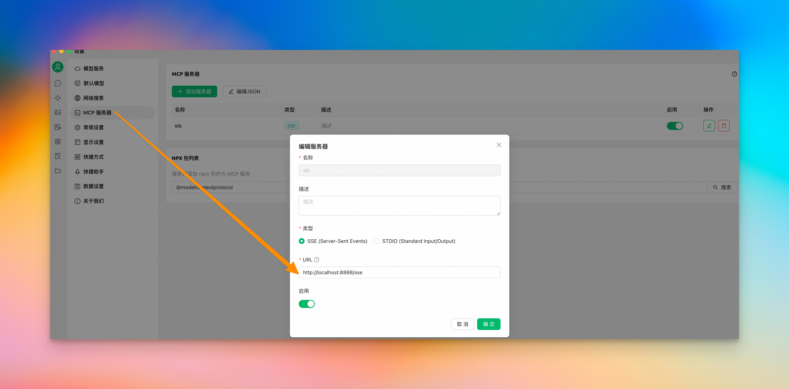
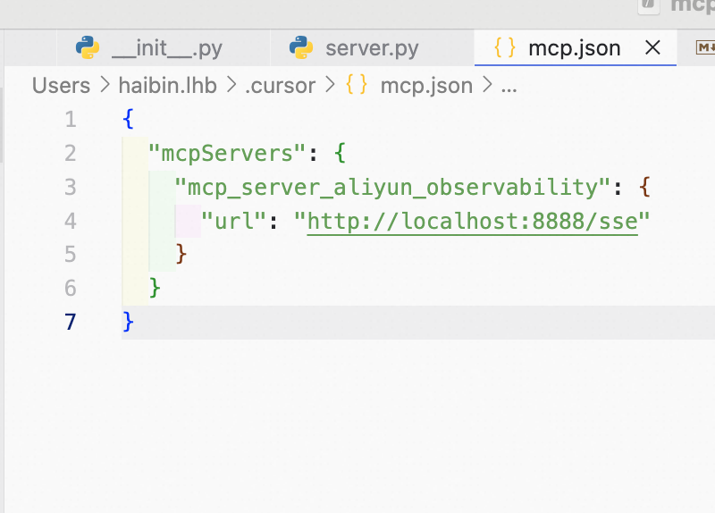
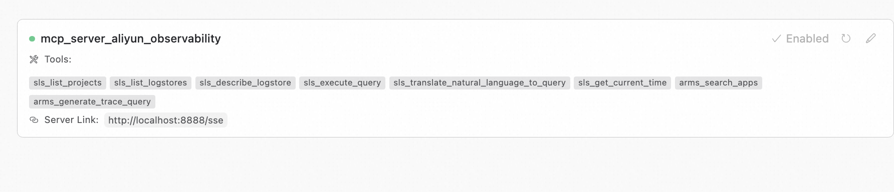
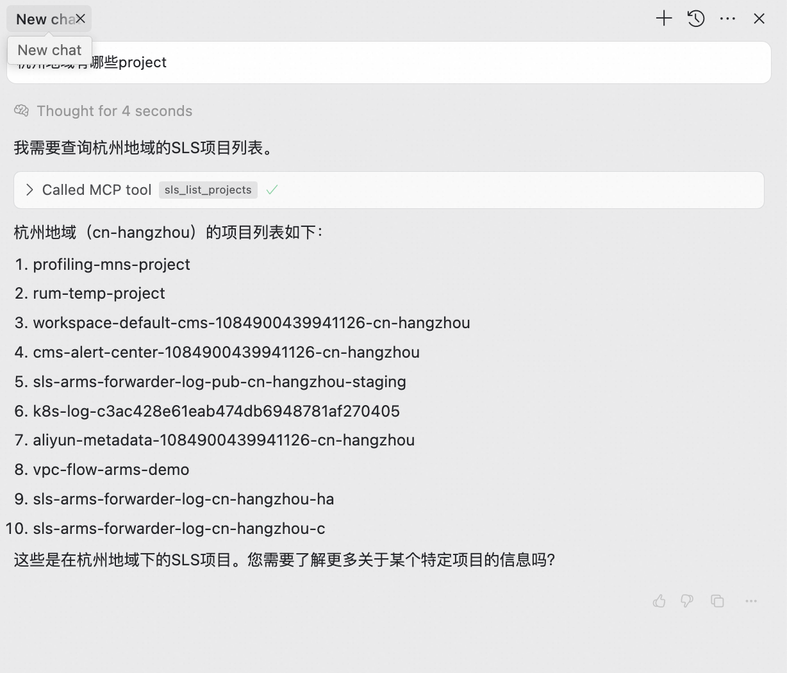
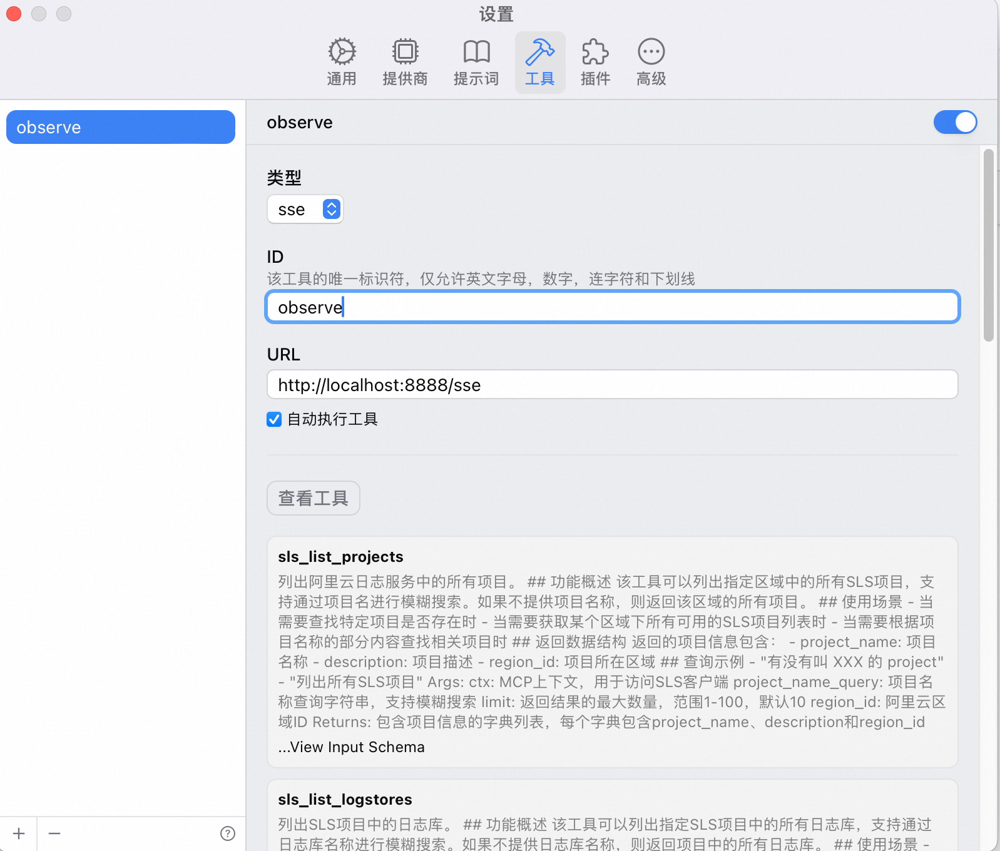
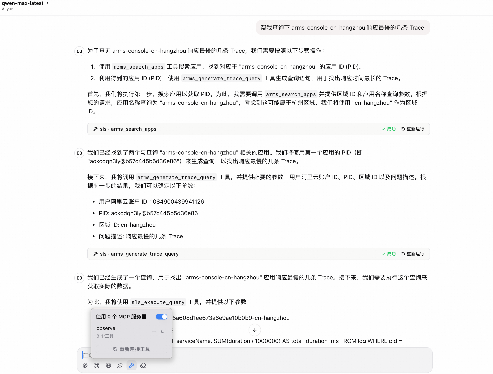

> 分支变动说明：`master` 已使用 `1.x.x` ；原 `master` 全量历史和代码已迁移到 `0.3.x` 分支，后续如需沿用旧版本，请在 `0.3.x` 上继续迭代。1.x 版本基于可观测 2.0 做了较大功能升级，工具形态与 0.3.x 有明显差异。详情见文末《0.3.x 与 1.x.x 工具差异对照》。后续我们将持续基于 1.x.x 版本维护和演进，感谢理解与支持。

## 什么是 Observable MCP Server

Observable MCP Server 是阿里云可观测官方推出的一个 MCP 服务，旨在为用户提供一整套的可观测 AI 交互能力，支持自然语言形式的多模态数据的访问和分析。可以与 Cursor、Cline、Windsurf 以及各类 Agent 框架无缝集成，使得企业人员可以更高效率和可靠地使用可观测数据。

## MCP 是如何工作的

MCP（Model Context Protocol）为 AI 模型和开发环境之间建立统一的上下文交互标准，使模型可以在安全受控的前提下访问实时的领域知识。Observable MCP Server 通过这一协议，将自然语言需求映射为标准化工具调用，再透明地调度底层的日志、链路、指标等可观测产品接口，让智能体无需额外适配即可获取结构化结果。

Observable MCP Server 现已支持日志服务 SLS、应用实时监控服务 ARMS、云监控 CloudMonitor、Prometheus 监控等多款产品的查询与分析能力，并持续扩展更多可观测服务。

## Observable MCP Server 的优势

1. 多源数据协同：一次接入即可同时查询 SLS、ARMS、CloudMonitor、Prometheus 等多款可观测产品的数据，统一呈现日志、指标与链路视角。
2. 自然语言驱动：无需手写查询语句，支持通过自然语言直接检索日志、链路、指标等信息，并返回结构化答案。
3. 企业级安全：基于阿里云 AccessKey 认证机制，服务端不额外采集数据，对每个工具的输入输出进行严格校验，保障数据安全可控。

## 阿里云可观测MCP服务
<p align="center">
  <a href="./README.md"></a>
  <a href="./README_EN.md"></a>
</p>

### 简介

阿里云可观测 MCP服务，提供了一系列访问阿里云可观测各产品的工具能力，覆盖产品包含阿里云日志服务SLS、阿里云应用实时监控服务ARMS、阿里云云监控等，任意支持 MCP 协议的智能体助手都可快速接入。

### 工具架构
项目采用模块化架构，提供四个主要工具集：

- **PaaS工具集**（可观测2.0，推荐）：包含 umodel 系列工具，提供统一数据模型的现代化可观测性能力
  - `entity`: 实体发现和管理 (3个工具)
  - `dataset`: 数据集和元数据管理 (3个工具)
  - `data`: 各类数据查询，支持metrics、logs、events、traces、profiles (8个工具)
- **IaaS工具集**（V1兼容）：传统SLS、CMS原生API工具，保持向后兼容 (11个工具)
- **Shared工具集**：跨服务共享工具，如workspace和domain管理 (3个工具)

### 核心功能特性

#### 🕐 统一时间范围表达式
所有数据查询工具支持灵活的时间范围格式：
- **相对预设**: `last_5m`, `last_1h`, `last_3d`, `last_1w`, `last_1M`, `last_1y`
- **Grafana风格**: `now-15m~now-5m`, `now-1h~now`
- **关键字**: `today`, `yesterday`
- **绝对时间戳**: `1706864400~1706868000`
- **人类可读**: `2024-02-02 10:10:10~2024-02-02 10:20:10`

#### 📊 时序对比分析（Metric Compare）
`umodel_get_metrics` 和 `umodel_get_golden_metrics` 支持通过 `offset` 参数进行时序对比：
```python
# 对比当前1小时与1天前的数据
umodel_get_metrics(
    domain="apm", entity_set_name="apm.service",
    metric_domain_name="apm.metric.apm.service", metric="request_count",
    time_range="last_1h", offset="1d"  # 与1天前对比
)
```
返回结果包含：
- `current`: 当前时段统计（max, min, avg, count）
- `compare`: 对比时段统计
- `diff`: 变化分析（trend, avg_change, avg_change_percent）
- `diff_score`: 差异评分（0-1，越大差异越显著）

#### 🔬 高级分析模式
`umodel_get_metrics` 支持四种分析模式：

| 模式 | 说明 | 输出字段 |
|------|------|---------|
| `basic` | 原始时序数据（默认） | `__ts__`, `__value__`, `__labels__` |
| `cluster` | K-Means时序聚类 | `__cluster_index__`, `__entities__`, `__sample_value__` |
| `forecast` | 时序预测（需1-5天历史数据） | `__forecast_ts__`, `__forecast_value__`, `__forecast_lower/upper_value__` |
| `anomaly_detection` | 异常检测（需1-3天数据） | `__anomaly_list_`, `__anomaly_msg__`, `__value_min/max/avg__` |

### 版本记录
可以查看 [CHANGELOG.md](./CHANGELOG.md)

### 常见问题
可以查看 [FAQ.md](./FAQ.md)

### 工具列表

#### PaaS工具集（可观测2.0）

##### 实体管理工具 (entity)
| 工具名称 | 用途 | 关键参数 | 最佳实践 |  
|---------|------|---------|---------|  
| `umodel_get_entities` | 获取指定实体集的实体列表 | `workspace`：工作空间名称（必需）<br>`domain`：实体域（必需）<br>`entity_set_name`：实体类型（必需）<br>`regionId`：阿里云区域ID（必需） | - 用于探索可用的实体资源<br>- 支持精确查询指定实体 |
| `umodel_get_neighbor_entities` | 获取实体的邻居节点 | `workspace`：工作空间名称（必需）<br>`domain`：实体域（必需）<br>`entity_set_name`：实体类型（必需）<br>`entity_ids`：实体ID列表（必需）<br>`regionId`：阿里云区域ID（必需） | - 探索服务依赖关系<br>- 构建拓扑图 |
| `umodel_search_entities` | 搜索匹配条件的实体 | `workspace`：工作空间名称（必需）<br>`domain`：实体域（必需）<br>`entity_set_name`：实体类型（必需）<br>`search_conditions`：搜索条件<br>`regionId`：阿里云区域ID（必需） | - 支持复杂查询条件<br>- 灵活实体发现 |

##### 数据集管理工具 (dataset)  
| 工具名称 | 用途 | 关键参数 | 最佳实践 |
|---------|------|---------|---------|
| `umodel_list_data_set` | 列出指定类型的数据集 | `workspace`：工作空间名称（必需）<br>`domain`：实体域（必需）<br>`entity_set_name`：实体类型（必需）<br>`data_set_types`：数据集类型（可选）<br>`regionId`：阿里云区域ID（必需） | - 发现可用的数据集<br>- 了解数据结构和字段 |
| `umodel_search_entity_set` | 搜索实体集 | `workspace`：工作空间名称（必需）<br>`search_text`：搜索关键词（必需）<br>`regionId`：阿里云区域ID（必需） | - 通过关键词发现实体集<br>- 支持模糊搜索 |
| `umodel_list_related_entity_set` | 列出相关联的实体集 | `workspace`：工作空间名称（必需）<br>`domain`：实体域（必需）<br>`entity_set_name`：实体类型（必需）<br>`regionId`：阿里云区域ID（必需） | - 了解实体集间的关联关系<br>- 探索数据依赖 |

##### 数据查询工具 (data)
| 工具名称 | 用途 | 关键参数 | 最佳实践 |
|---------|------|---------|---------|  
| `umodel_get_metrics` | 获取实体的时序指标数据，支持高级分析模式和时序对比 | `workspace`：工作空间名称（必需）<br>`domain`：实体域（必需）<br>`entity_set_name`：实体类型（必需）<br>`metric_domain_name`：指标域名称（必需）<br>`metric`：指标名称（必需）<br>`analysis_mode`：分析模式（可选，默认basic）<br>`forecast_duration`：预测时长（可选）<br>`offset`：对比偏移量（可选，如1h/1d/1w）<br>`time_range`：时间范围表达式（可选）<br>`regionId`：阿里云区域ID（必需） | - 支持range/instant查询<br>- **basic**: 原始时序数据<br>- **cluster**: K-Means聚类分析<br>- **forecast**: 时序预测（需1-5天数据）<br>- **anomaly_detection**: 异常检测（需1-3天数据）<br>- **时序对比**: 使用offset参数对比不同时段数据 |
| `umodel_get_golden_metrics` | 获取黄金指标数据，支持时序对比 | `workspace`：工作空间名称（必需）<br>`domain`：实体域（必需）<br>`entity_set_name`：实体类型（必需）<br>`offset`：对比偏移量（可选，如1h/1d/1w）<br>`time_range`：时间范围表达式（可选）<br>`regionId`：阿里云区域ID（必需） | - 快速获取关键性能指标<br>- 包含延迟、吞吐量、错误率等<br>- 支持与历史时段对比分析 |
| `umodel_get_relation_metrics` | 获取实体间关系级别的指标 | `workspace`：工作空间名称（必需）<br>`src_domain`：源实体域（必需）<br>`src_entity_set_name`：源实体类型（必需）<br>`src_entity_ids`：源实体ID列表（必需）<br>`relation_type`：关系类型（必需）<br>`direction`：关系方向（必需）<br>`regionId`：阿里云区域ID（必需） | - 分析微服务调用关系<br>- 支持服务依赖分析 |
| `umodel_get_logs` | 获取实体相关的日志数据 | `workspace`：工作空间名称（必需）<br>`domain`：实体域（必需）<br>`entity_set_name`：实体类型（必需）<br>`log_set_name`：日志集名称（必需）<br>`log_set_domain`：日志集域（必需）<br>`regionId`：阿里云区域ID（必需） | - 用于故障诊断<br>- 支持性能分析 |
| `umodel_get_events` | 获取实体的事件数据 | `workspace`：工作空间名称（必需）<br>`domain`：实体域（必需）<br>`entity_set_name`：实体类型（必需）<br>`event_set_domain`：事件集域（必需）<br>`event_set_name`：事件集名称（必需）<br>`regionId`：阿里云区域ID（必需） | - 用于异常事件分析<br>- 支持告警事件追踪 |
| `umodel_get_traces` | 获取指定trace ID的详细数据，包含独占耗时 | `workspace`：工作空间名称（必需）<br>`domain`：实体域（必需）<br>`entity_set_name`：实体类型（必需）<br>`trace_set_domain`：链路集域（必需）<br>`trace_set_name`：链路集名称（必需）<br>`trace_ids`：链路ID列表（必需）<br>`regionId`：阿里云区域ID（必需） | - 深入分析调用链<br>- 包含 `exclusive_duration_ms` 独占耗时<br>- 按独占耗时排序定位瓶颈 |
| `umodel_search_traces` | 基于条件搜索调用链 | `workspace`：工作空间名称（必需）<br>`domain`：实体域（必需）<br>`entity_set_name`：实体类型（必需）<br>`trace_set_domain`：链路集域（必需）<br>`trace_set_name`：链路集名称（必需）<br>`regionId`：阿里云区域ID（必需） | - 支持按持续时间、错误状态过滤<br>- 返回链路摘要信息 |
| `umodel_get_profiles` | 获取性能剖析数据 | `workspace`：工作空间名称（必需）<br>`domain`：实体域（必需）<br>`entity_set_name`：实体类型（必需）<br>`profile_set_domain`：性能剖析集域（必需）<br>`profile_set_name`：性能剖析集名称（必需）<br>`entity_ids`：实体ID列表（必需）<br>`regionId`：阿里云区域ID（必需） | - 用于性能瓶颈分析<br>- 包含CPU、内存使用情况 |
| `cms_natural_language_query` | 自然语言数据查询 | `query`：自然语言查询文本（必需） | - 使用自然语言查询可观测数据<br>- 支持指标、日志、链路等数据类型<br>- 自动理解查询意图并返回结果<br>- workspace和regionId从环境变量获取<br>- 默认查询最近15分钟数据 |

#### Shared工具集（共享工具）

##### 工作空间和域管理
| 工具名称 | 用途 | 关键参数 | 最佳实践 |
|---------|------|---------|---------|
| `introduction` | 获取服务介绍和使用说明 | 无需参数 | - 首次接入时了解服务能力<br>- 作为 LLM Agent 的自我介绍工具 |
| `list_workspace` | 获取可用工作空间列表 | `regionId`：阿里云区域ID（必需） | - 在使用其他工具前先获取工作空间<br>- 支持跨区域工作空间查询 |
| `list_domains` | 获取工作空间中的所有实体域 | `workspace`：工作空间名称（必需）<br>`regionId`：阿里云区域ID（必需） | - 在查询实体前先了解可用的域<br>- 了解数据分类情况 |

#### IaaS工具集（V1兼容）

##### SLS和CMS原生API工具
| 工具名称 | 用途 | 关键参数 | 最佳实践 |  
|---------|------|---------|---------|  
| `cms_text_to_promql` | 将自然语言转换为PromQL查询 | `text`：自然语言问题（必需）<br>`project`：项目名称（必需）<br>`metricStore`：指标存储名称（必需）<br>`regionId`：阿里云区域ID（必需） | - 智能生成PromQL语句<br>- 简化查询操作 |
| `sls_text_to_sql` | 将自然语言转换为SQL查询 | `text`：自然语言问题（必需）<br>`project`：SLS项目名称（必需）<br>`logStore`：日志存储名称（必需）<br>`regionId`：阿里云区域ID（必需） | - 使用CMS Chat API智能生成SQL<br>- 支持自然语言交互<br>- 自动处理未索引字段 |
| `sls_text_to_sql_old` | ⚠️ [已废弃] 将自然语言转换为SQL查询（旧版） | `text`：自然语言问题（必需）<br>`project`：SLS项目名称（必需）<br>`logStore`：日志存储名称（必需）<br>`regionId`：阿里云区域ID（必需） | - 已废弃，请使用 sls_text_to_sql<br>- 仅作为备选方案 |
| `sls_execute_sql` | 执行SLS SQL查询 | `project`：SLS项目名称（必需）<br>`logStore`：日志存储名称（必需）<br>`query`：SQL查询语句（必需）<br>`from_time`：查询开始时间（必需）<br>`to_time`：查询结束时间（必需）<br>`limit`：返回最大日志条数，1-100，默认10（可选）<br>`offset`：查询开始行，用于分页，默认0（可选）<br>`reverse`：是否按时间戳降序返回，默认False（可选）<br>`regionId`：阿里云区域ID（必需） | - 直接执行SQL查询<br>- 使用适当时间范围优化性能<br>- 支持分页查询获取更多日志 |
| `cms_execute_promql` | 执行PromQL查询 | `project`：项目名称（必需）<br>`metricStore`：指标存储名称（必需）<br>`query`：PromQL查询语句（必需）<br>`from_time`：查询开始时间（可选，默认now-5m）<br>`to_time`：查询结束时间（可选，默认now）<br>`regionId`：阿里云区域ID（必需） | - 查询云监控指标数据<br>- 支持标准PromQL语法 |
| `sls_text_to_spl` | 将自然语言转换为SPL查询 | `text`：自然语言问题（必需）<br>`project`：SLS项目名称（必需）<br>`logStore`：日志存储名称（必需）<br>`data_sample`：样例数据（必需）<br>`regionId`：阿里云区域ID（必需） | - 智能生成SPL语句并基于样例数据执行<br>- 适用于数据加工、提取场景 |
| `sls_sop` | SLS使用助手 | `text`：关于SLS使用的问题（必需）<br>`regionId`：阿里云区域ID（必需） | - 回答SLS功能使用、概念解释、操作步骤等问题<br>- 智能助手 |
| `sls_list_projects` | 列出SLS项目 | `projectName`：项目名称（可选，模糊搜索）<br>`regionId`：阿里云区域ID（必需） | - 发现可用的SLS项目<br>- 支持模糊搜索 |
| `sls_execute_spl` | 执行原生SPL查询 | `query`：SPL查询语句（必需）<br>`workspace`：CMS工作空间名称（必需）<br>`from_time`：开始时间（可选）<br>`to_time`：结束时间（可选）<br>`regionId`：阿里云区域ID（必需） | - 执行复杂的SLS查询<br>- 支持高级分析功能 |
| `sls_list_logstores` | 列出指定项目的日志存储 | `project`：SLS项目名称（必需）<br>`regionId`：阿里云区域ID（必需） | - 发现项目中的日志存储<br>- 了解数据分布 |
| `sls_get_context_logs` | 获取日志上下文 | `project`：SLS项目名称（必需）<br>`logStore`：日志存储名称（必需）<br>`pack_id`：日志包ID（必需）<br>`pack_meta`：日志包元数据（必需）<br>`regionId`：阿里云区域ID（必需） | - 查看日志前后文<br>- 用于故障排查 |
| `sls_log_explore` | 日志探索分析 | `project`：SLS项目名称（必需）<br>`logStore`：日志存储名称（必需）<br>`from_time`：开始时间（必需）<br>`to_time`：结束时间（必需）<br>`regionId`：阿里云区域ID（必需） | - 快速了解日志分布<br>- 发现日志模式 |
| `sls_log_compare` | 日志对比分析 | `project`：SLS项目名称（必需）<br>`logStore`：日志存储名称（必需）<br>`test_from_time`：实验组开始时间（可选）<br>`test_to_time`：实验组结束时间（可选）<br>`control_from_time`：对照组开始时间（可选）<br>`control_to_time`：对照组结束时间（可选）<br>`regionId`：阿里云区域ID（必需） | - 对比不同时段日志<br>- 发现异常变化 |

### 权限要求

为了确保 MCP Server 能够成功访问和操作您的阿里云可观测性资源，您需要配置以下权限：

1.  **阿里云访问密钥 (AccessKey)**：
    *   服务运行需要有效的阿里云 AccessKey ID 和 AccessKey Secret。
    *   获取和管理 AccessKey，请参考 [阿里云 AccessKey 管理官方文档](https://help.aliyun.com/document_detail/53045.html)。
  
2. 当你初始化时候不传入 AccessKey 和 AccessKey Secret 时，会使用[默认凭据链进行登录](https://www.alibabacloud.com/help/zh/sdk/developer-reference/v2-manage-python-access-credentials#62bf90d04dztq)
   1. 如果环境变量 中的ALIBABA_CLOUD_ACCESS_KEY_ID 和 ALIBABA_CLOUD_ACCESS_KEY_SECRET均存在且非空，则使用它们作为默认凭据。
   2. 如果同时设置了ALIBABA_CLOUD_ACCESS_KEY_ID、ALIBABA_CLOUD_ACCESS_KEY_SECRET和ALIBABA_CLOUD_SECURITY_TOKEN，则使用STS Token作为默认凭据。
   
3.  **RAM 授权 (重要)**：
    *   与 AccessKey 关联的 RAM 用户或角色**必须**被授予访问相关云服务所需的权限。
    *   **强烈建议遵循"最小权限原则"**：仅授予运行您计划使用的 MCP 工具所必需的最小权限集，以降低安全风险。
    *   根据您需要使用的工具，参考以下文档进行权限配置：
        *   **日志服务 (SLS)**：如果您需要使用 `sls_*` 相关工具，请参考 [日志服务权限说明](https://help.aliyun.com/zh/sls/overview-8)，并授予必要的读取、查询等权限。
        *   **应用实时监控服务 (ARMS)**：如果您需要使用 `arms_*` 相关工具，请参考 [ARMS 权限说明](https://help.aliyun.com/zh/arms/security-and-compliance/overview-8?scm=20140722.H_74783._.OR_help-T_cn~zh-V_1)，并授予必要的查询权限。
        *   **数字员工 (sls_text_to_sql)**：如果您需要使用 `sls_text_to_sql` 工具，需授予数字员工对话权限。该工具使用默认数字员工 `apsara-ops`。最小权限策略：`cms:CreateChat`, `cms:CreateThread`, `cms:GetThread`, `cms:ListThreads`，资源范围 `acs:cms:*:*:digitalemployee/*`。详见 [数字员工权限配置](https://help.aliyun.com/zh/cms/cloudmonitor-2-0/digital-employee-permission-configuration)。
    * 特殊权限说明，如果使用了SQL生成之类的工具，需要单独授予`sls:CallAiTools`的权限
    *   请根据您的实际应用场景，精细化配置所需权限。

  

### 安全与部署建议

请务必关注以下安全事项和部署最佳实践：

1.  **密钥安全**：
    *   本 MCP Server 在运行时会使用您提供的 AccessKey 调用阿里云 OpenAPI，但**不会以任何形式存储您的 AccessKey**，也不会将其用于设计功能之外的任何其他用途。

2.  **访问控制 (关键)**：
    *   当您选择通过 **SSE (Server-Sent Events) 协议** 访问 MCP Server 时，**您必须自行负责该服务接入点的访问控制和安全防护**。
    *   **强烈建议**将 MCP Server 部署在**内部网络或受信环境**中，例如您的私有 VPC (Virtual Private Cloud) 内，避免直接暴露于公共互联网。
    *   推荐的部署方式是使用**阿里云函数计算 (FC)**，并配置其网络设置为**仅 VPC 内访问**，以实现网络层面的隔离和安全。
    *   **注意**：**切勿**在没有任何身份验证或访问控制机制的情况下，将配置了您 AccessKey 的 MCP Server SSE 端点暴露在公共互联网上，这会带来极高的安全风险。

### 使用说明


在使用 MCP Server 之前，需要先获取阿里云的 AccessKeyId 和 AccessKeySecret，请参考 [阿里云 AccessKey 管理](https://help.aliyun.com/document_detail/53045.html)


#### 使用 pip 安装
> ⚠️ 需要 Python 3.10 及以上版本。

直接使用 pip 安装即可，安装命令如下：

```bash
# 安装（包含所有功能和依赖）
pip install mcp-server-aliyun-observability
```
1. 安装之后，直接运行即可，运行命令如下：

```bash
# 默认使用streamableHttp方式启动
python -m mcp_server_aliyun_observability

# 指定访问密钥启动
python -m mcp_server_aliyun_observability --access-key-id <your_access_key_id> --access-key-secret <your_access_key_secret>

# 使用SSE方式启动（用于远程访问）
python -m mcp_server_aliyun_observability --transport sse --transport-port 8000 --host 0.0.0.0
```

可通过命令行传递指定参数:
- `--transport` 指定传输方式，可选值为 `stdio`、`sse`、`streamable-http`，默认值为 `streamable-http`
- `--access-key-id` 指定阿里云 AccessKeyId，不指定时会使用环境变量中的ALIBABA_CLOUD_ACCESS_KEY_ID
- `--access-key-secret` 指定阿里云 AccessKeySecret，不指定时会使用环境变量中的ALIBABA_CLOUD_ACCESS_KEY_SECRET
- `--sls-endpoints` 覆盖 SLS 端点映射，格式 `REGION=HOST`，可用逗号/空格分隔多个区域，如 `--sls-endpoints "cn-shanghai=cn-hangzhou.log.aliyuncs.com"`
- `--cms-endpoints` 覆盖 CMS 端点映射，格式同上，例如 `--cms-endpoints "cn-shanghai=cms.internal.aliyuncs.com"`
- `--scope` 指定工具范围，可选值为 `paas`、`iaas`、`all`，默认值为 `all`
- `--log-level` 指定日志级别，可选值为 `DEBUG`、`INFO`、`WARNING`、`ERROR`，默认值为 `INFO`
- `--transport-port` 指定传输端口，默认值为 `8080`，仅当 `--transport` 为 `sse` 或 `streamable-http` 时有效
- `--host` 指定监听地址，默认值为 `127.0.0.1`
- `--knowledge-config` 指定外部知识库配置文件路径（可选）

**环境变量**:
- `ALIBABA_CLOUD_ACCESS_KEY_ID` - 阿里云 AccessKey ID
- `ALIBABA_CLOUD_ACCESS_KEY_SECRET` - 阿里云 AccessKey Secret
- `ALIBABA_CLOUD_SECURITY_TOKEN` - STS Token（可选）
- `LANGUAGE` - 数字员工对话语言（默认 `zh`）
- `TIMEZONE` - 数字员工对话时区（默认 `Asia/Shanghai`）

### 使用 uvx 安装运行

```bash
# 使用 uvx 直接运行最新版本
uvx mcp-server-aliyun-observability

# 指定版本运行
uvx --from 'mcp-server-aliyun-observability==1.0.0' mcp-server-aliyun-observability
```

### 从源码安装

```bash

# clone 源码
git clone git@github.com:aliyun/alibabacloud-observability-mcp-server.git
# 进入源码目录
cd alibabacloud-observability-mcp-server
# 安装
pip install -e .
# 运行
python -m mcp_server_aliyun_observability
```

### MCP 测试客户端

项目提供了一个符合 MCP 协议规范的测试客户端，用于验证服务器功能：

```bash
# 进入测试客户端目录
cd mcp_test_client

# 运行所有测试
python mcp_client.py

# 运行特定类别测试
python mcp_client.py --category shared  # 共享工具测试
python mcp_client.py --category iaas    # IaaS工具测试
python mcp_client.py --category paas    # PaaS工具测试

# 指定服务器地址
python mcp_client.py --host 127.0.0.1 --port 8080
```

测试客户端特性：
- **MCP协议兼容**: 完整实现 MCP 初始化流程（initialize → notifications/initialized）
- **自动重试**: 失败测试自动根据错误反馈修正参数重试
- **智能截断**: 输出保留关键信息，列表数据展示首条完整记录
- **分类测试**: 支持按 shared/iaas/paas 分类运行测试
- **资源发现缓存**: 自动缓存发现的资源用于后续测试


### Transport 选择指南

MCP服务器支持三种传输协议，选择合适的协议取决于您的使用场景：

| Transport类型 | 适用场景 | 优势 | 限制 |
|--------------|---------|------|------|
| **streamableHttp** ✅ | 生产环境、Web应用（推荐） | - 现代HTTP流式协议<br>- 性能优异<br>- 生产级稳定性 | - 需要网络配置 |
| **stdio** | 本地开发、命令行工具 | - 最简单的集成方式<br>- 无网络配置要求<br>- 直接进程间通信 | - 仅限本地使用<br>- 无法多客户端同时访问 |
| **sse** (Server-Sent Events) | Web应用、远程访问 | - 支持远程连接<br>- 基于标准HTTP协议<br>- 支持多客户端 | - 需要维护长连接<br>- 性能较streamableHttp略低 |

> 💡 **推荐使用**: 生产环境和Web应用使用 `streamableHttp`（默认），本地开发使用 `stdio`，特殊场景使用 `sse`

### AI 工具集成

#### Cursor，Cline 等集成

**推荐方式：使用 streamableHttp（默认）**
```bash
python -m mcp_server_aliyun_observability
```
```json
{
  "mcpServers": {
    "alibaba_cloud_observability": {
      "url": "http://localhost:8000"
    }
  }
}
```

**使用 uvx 启动方式**
```json
{
  "mcpServers": {
    "alibaba_cloud_observability": {
      "command": "uvx",
      "args": [
        "mcp-server-aliyun-observability"
      ],
      "env": {
        "ALIBABA_CLOUD_ACCESS_KEY_ID": "<your_access_key_id>",
        "ALIBABA_CLOUD_ACCESS_KEY_SECRET": "<your_access_key_secret>"
      }
    }
  }
}
```

**使用 stdio 启动方式（本地开发）**
```json
{
  "mcpServers": {
    "alibaba_cloud_observability": {
      "command": "uvx",
      "args": [
        "mcp-server-aliyun-observability",
        "--transport",
        "stdio"
      ],
      "env": {
        "ALIBABA_CLOUD_ACCESS_KEY_ID": "<your_access_key_id>",
        "ALIBABA_CLOUD_ACCESS_KEY_SECRET": "<your_access_key_secret>"
      }
    }
  }
}
```

#### Cherry Studio集成




#### Cursor集成








#### ChatWise集成





## 0.3.x 与 1.x.x 工具差异对照

1.x 基于可观测 2.0 做了大规模升级：日志/指标/事件/链路等能力以 UModel 结构化接口为主（`umodel_*`），并补充了少量 IaaS 直连工具。下表汇总了新增、替换/重命名和移除的能力，便于从 0.3.x 迁移。

### 替换 / 重命名
| 0.3.x 工具 | 1.x.x 对应             | 变化类型             | 说明 |
| --- |----------------------|------------------| --- |
| `sls_translate_text_to_sql_query` | `sls_text_to_sql`    | 重命名              | 依然用于将自然语言生成 SLS 查询语句。 |
| `sls_execute_sql_query` | `sls_execute_sql`    | 重命名              | 执行 SLS 查询，参数名与时间解析方式调整。 |
| `sls_text_to_spl` |                      | 自然语言转 SPL 查询并执行。 |
| `sls_sop` |                      | SLS 智能问答助手。      |
| `cms_translate_text_to_promql` | `cms_text_to_promql` | 重命名              | 生成 PromQL 查询文本。 |
| `cms_execute_promql_query` | `cms_execute_promql` | 重命名              | 执行 PromQL，底层改为通过 SLS metricstore 包装执行。 |
| `sls_list_projects` | `sls_list_projects`  | 保留/增强            | 保留，增加参数校验与提示。 |
| `sls_list_logstores` | `sls_list_logstores` | 保留/增强            | 保留，支持指标库筛选等参数。 |

### 新增（1.x.x 独有）
| 新工具 | 能力说明 |
| --- | --- |
| `sls_execute_spl` | 直接执行 SPL 查询（高级用法）。 |
| `sls_text_to_sql_old` | ⚠️ [已废弃] 旧版text-to-SQL工具，使用SLS CallAiTools API。请优先使用 sls_text_to_sql。 |
| `sls_get_context_logs` | 获取日志上下文，用于查看日志前后文。 |
| `sls_log_explore` | 日志探索分析，快速了解日志分布和模式。 |
| `sls_log_compare` | 日志对比分析，对比不同时段日志发现异常。 |
| `list_workspace` / `list_domains` / `introduction` | 工作空间/域发现与服务自述。 |
| `umodel_get_entities` / `umodel_get_neighbor_entities` / `umodel_search_entities` | 实体发现与邻居查询。 |
| `umodel_list_data_set` / `umodel_search_entity_set` / `umodel_list_related_entity_set` | 数据集枚举、实体集搜索及关联关系发现。 |
| `umodel_get_metrics` / `umodel_get_golden_metrics` / `umodel_get_relation_metrics` | 指标与关系级指标查询。支持高级分析模式：cluster(聚类)、forecast(预测)、anomaly_detection(异常检测)。支持时序对比（offset参数）。 |
| `umodel_get_logs` / `umodel_get_events` | 日志、事件查询。 |
| `umodel_get_traces` / `umodel_search_traces` | 链路明细与搜索。 |
| `umodel_get_profiles` | 性能剖析数据查询。 |

### 移除 / 暂不提供
| 0.3.x 工具 | 状态 | 说明 |
| --- | --- | --- |
| `sls_describe_logstore` | 移除 | 1.x 以 UModel 元数据与 `umodel_list_data_set` 为主，不再暴露 describe 接口。 |
| `sls_diagnose_query` | 移除 | 未在 1.x 保留。 |
| `arms_*` 系列（`arms_search_apps`、`arms_generate_trace_query`、`arms_profile_flame_analysis`、`arms_diff_profile_flame_analysis`、`arms_get_application_info`、`arms_trace_quality_analysis`、`arms_slow_trace_analysis`、`arms_error_trace_analysis`） | 移除 | 1.x 聚焦可观测 2.0 数据模型，未提供 ARMS 专用工具。 |
| `sls_get_regions` / `sls_get_current_time` | 移除 | 通用工具未在 1.x 延续。 |

迁移建议：优先改用 `umodel_*` 系列获取实体、数据集与指标/日志/事件/链路；仅在需要直接操作 SLS/CMS 时使用 IaaS 工具（`sls_*`、`cms_*`）。***
